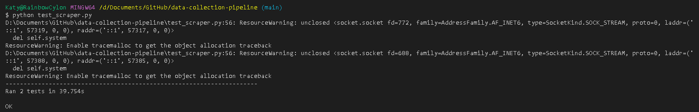

# Data Collection Pipeline

In this project I have...

**Technologies used:**

- Python
- Selenium - used to perform simple functions within the web browser to navigate the website.
- Docker

## Milestone 1/2

I set up my github repo and chose the website I would be scraping. I chose Waterstones and will be focussing on the Thrillers section of the site 

## Milestone 3

I have built the Scraper class which allows the user to get_website() and accept_cookies(). Following this it scrolls to the bottom of the page and clicks a "See More" button and prints "There are {96} books on this page". It then copies the link for each book into a list_of_links and prints the list. At this stage, I have also extracted data from the first book in the list, such as price, author and star rating and plan to follow this into the next milestone.

``` python

from selenium import webdriver
import time
from selenium.webdriver.common.by import By
from selenium.webdriver.common.keys import Keys

options = webdriver.ChromeOptions() 
options.add_experimental_option("excludeSwitches", ["enable-logging"])

class Scraper:
    def __init__(self):
        self.URL = 'https://www.waterstones.com/category/crime-thrillers-mystery/thrillers/page/1'
        self.driver = webdriver.Chrome(options=options)
        self.one_book = ''

        if __name__ == "__main__":
            self.get_website()
            self.accept_cookies()
            self.get_link()
            self.get_price()
            self.get_author()
            self.get_rating()
            self.scroll_to_more_books()
            self.get_list_of_links()
            self.scroll()


    def get_website(self):
        self.driver.get(self.URL)

    def accept_cookies(self):
        time.sleep(2)
        try:
            accept_cookies_button = self.driver.find_element(by=By.XPATH, value='//*[@id="onetrust-accept-btn-handler"]')
            accept_cookies_button.click()
        except AttributeError:
            accept_cookies_button = self.driver.find_element(by=By.XPATH, value='//*[@id="onetrust-accept-btn-handler"]')
            accept_cookies_button.click()

        except:
            pass

    def get_link(self):
        time.sleep(2)
        self.one_book = self.driver.find_element(by=By.XPATH,value='//*[@data-productid="11647634"]')
        a_tag = self.one_book.find_element(by=By.TAG_NAME, value='a')
        link = a_tag.get_attribute('href')
        print(link)

    def get_price(self):
        price = self.driver.find_element(by=By.XPATH, value='//*[@id="p_11647634"]/div/div[2]/div[2]/span[3]').text
        print(price)
    
    def get_author(self):
        author = self.driver.find_element(by=By.XPATH, value='//*[@id="p_11647634"]/div/div[2]/span/a/b').text
        print(author)

    def get_rating(self):
        rating = self.driver.find_element(by=By.XPATH, value='//*[@id="p_11647634"]/div/div[2]/div[3]').text #TODO find out how to make this work with coloured in stars
        print(rating)

    def scroll(self):
        self.driver.execute_script("window.scrollBy(0,document.body.scrollHeight);")

    def scroll_to_more_books(self):
        scroll = self.scroll()
        time.sleep(1)
        scroll = self.scroll()
        time.sleep(1)
        scroll = self.scroll()
        time.sleep(1)
        show_more_button = self.driver.find_element(by=By.XPATH, value='/html/body/div[1]/div[2]/div[3]/div[3]/button')
        show_more_button.click()
        time.sleep(2)
        scroll = self.scroll()
        time.sleep(1)

    def get_list_of_links(self):
        book_shelf = self.driver.find_element(by=By.XPATH, value='/html/body/div[1]/div[2]/div[3]/div[2]')
        book_list = book_shelf.find_elements(by=By.XPATH, value='./div')
        list_of_links = []

        for book in book_list:
            a_tag = book.find_element(by=By.TAG_NAME, value='a')
            link = a_tag.get_attribute('href')
            list_of_links.append(link)

        print (f'There are {len(list_of_links)} books on this page')
        print(list_of_links)

```

 

## Milestone 4

In this milestone I have used the Scraper() class from the previous milestone as a template to retrieve the text and image data from the page. I created a crawler to iterate through the URLs in my list_of_links and extract the data, storing them in a raw_data folder. Each book is saved in the folder as their unique ISBN number, and each folder contains a Json file with the extracted text data, and a jpeg image of the cover of the book, saved as {ISBN}.jpg. 
The Json file contains a dictionary of the book Title, Author, Rating, Synopsis, ISBN, Number of Pages and Price.

``` python
from selenium import webdriver
import time
from selenium.webdriver.common.by import By
import os
import json
import requests


options = webdriver.ChromeOptions() 
options.add_experimental_option("excludeSwitches", ["enable-logging"])
books_dicts = []

class Scraper:
    def __init__(self):
        self.driver = webdriver.Chrome(options=options)
        self.list_of_links = []
        self.isbn = ''


        if __name__ == "__main__":
            self.get_website()
            self.accept_cookies()
            self.scroll_to_more_books()
            self.get_list_of_links()


    def get_website(self):
        URL = 'https://www.waterstones.com/category/crime-thrillers-mystery/thrillers/format/17'
        self.driver.get(URL)

    def accept_cookies(self):
        time.sleep(2)
        try:
            accept_cookies_button = self.driver.find_element(by=By.XPATH, value='//*[@id="onetrust-accept-btn-handler"]')
            accept_cookies_button.click()
        except:
            pass
    
    def scroll(self):
        self.driver.execute_script("window.scrollBy(0,document.body.scrollHeight);")
        time.sleep(1)

    def click_show_more(self):
        show_more_button = self.driver.find_element(by=By.XPATH, value='/html/body/div[1]/div[2]/div[3]/div[3]/button')
        show_more_button.click()
        time.sleep(2)

    def scroll_to_more_books(self):
        self.scroll()
        self.scroll()
        self.scroll()
        self.click_show_more()
        self.scroll()

    def get_list_of_links(self):
            book_shelf = self.driver.find_element(by=By.XPATH, value='/html/body/div[1]/div[2]/div[3]/div[2]')
            book_list = book_shelf.find_elements(by=By.XPATH, value='./div')

            for book in book_list:
                a_tag = book.find_element(by=By.TAG_NAME, value='a')
                link = a_tag.get_attribute('href')
                self.list_of_links.append(link)

            print (f'There are {len(self.list_of_links)} books on this page')
            print(self.list_of_links)
            return self.list_of_links

    def get_title(self):
        title = self.driver.find_element(by=By.XPATH, value='//*[@itemprop="name"]').text
        return title

    def get_price(self):
        price = self.driver.find_element(by=By.XPATH, value='//*[@itemprop="price"]').text
        return price
    
    def get_author(self):
        author = self.driver.find_element(by=By.XPATH, value='//*[@itemprop="author"]').text
        return author

    def get_rating(self):
        full_stars = self.driver.find_elements(by=By.XPATH, value='//*[@class="star-icon full"]') 
        half_star = []
        try:
            half_star.append(self.driver.find_element(by=By.XPATH, value='//*[@class="star-icon half"]'))
        except:
            pass
        rating = len(full_stars) + (len(half_star)/2)
        return rating

    def get_isbn(self):
        isbn = self.driver.find_element(by=By.XPATH, value='/html/body/div[1]/div[2]/div[2]/section[2]/div[2]/div[1]/div/p/i[2]/span').text
        return isbn

    def get_synopsis(self):
        synopsis = ''
        description = self.driver.find_element(by=By.XPATH, value='//*[@id="scope_book_description"]')
        list_of_paragraphs = description.find_elements(by=By.TAG_NAME, value='p')
        for paragraph in list_of_paragraphs:
            synopsis += paragraph.text
        print(synopsis)
        

    def get_number_of_pages(self):
        number_of_pages = self.driver.find_element(by=By.XPATH, value='/html/body/div[1]/div[2]/div[2]/section[2]/div[2]/div[1]/div/p/i[3]/span').text
        return number_of_pages

    def get_all_text_data(self):
        title = self.get_title()
        author = self.get_author()
        rating = self.get_rating()
        synopsis = self.get_synopsis()
        self.isbn = self.get_isbn()
        price = self.get_price()
        number_of_pages = self.get_number_of_pages()
        #books_dicts.append({'Title': title, 'Author': author, 'Rating': rating, 'Synopsis': synopsis, 'ISBN': isbn, 'Number of Pages': number_of_pages})
        self.create_product_folder()
        data = {
            'Title': title, 
            'Author': author, 
            'Rating': rating, 
            'Synopsis': synopsis, 
            'ISBN': self.isbn, 
            'Number of Pages': number_of_pages,
            'Price': price
        }
        self.create_json(data)

    def get_cover_image(self):
        img_tag = self.driver.find_element(by=By.XPATH, value='//*[@id="scope_book_image"]')
        image_url = img_tag.get_attribute('src')
        image_data = requests.get(image_url).content
        with open(f'D:/Documents/GitHub/data-collection-pipeline/raw_data/{self.isbn}/{self.isbn}.jpg', 'wb') as handler:
            handler.write(image_data)
        

    def create_raw_data_folder(self):
        if not os.path.exists('D:/Documents/GitHub/data-collection-pipeline/raw_data'):
            os.mkdir('D:/Documents/GitHub/data-collection-pipeline/raw_data')

    def create_product_folder(self):
        os.mkdir(f'D:/Documents/GitHub/data-collection-pipeline/raw_data/{self.isbn}')

    def create_json(self, data):
        with open(f'D:/Documents/GitHub/data-collection-pipeline/raw_data/{self.isbn}/data.json', 'w', encoding='utf-8') as f:
            json.dump(data, f)


def scrape():
    scraper = Scraper()
    for URL in scraper.list_of_links:
        scraper.driver.get(URL)
        time.sleep(1)
        scraper.create_raw_data_folder()
        scraper.get_all_text_data()
        scraper.get_cover_image()

scrape()

```

 
 

## Milestone 5

In this milestone I refactored my code, added docstrings and created test_scraper.py which contain a unit tests and an intergration test. 
My unit tests evaluate that a book is created in memory, that a product folder is created with the correct name and that the image is stored as a jpg.
The integration test ensures firstly that the Book class is initialilsed, then a product folder with the correct name is created, that the data gets stored as a json file and lastly that the image is stored as a jpg.

```python
from scraper import Scraper
from book import Book
from file_system_manager import FileManager
from selenium import webdriver
from driver import Driver
import unittest
from time import sleep
from os import path
from shutil import rmtree


options = webdriver.ChromeOptions() 
options.add_experimental_option("excludeSwitches", ["enable-logging"])

class ScraperTestCase(unittest.TestCase):

    def setUp(self):
        url = "https://www.waterstones.com/book/no-plan-b/lee-child/andrew-child/2928377082253"
        initialise_driver = Driver()
        driver = initialise_driver.get_driver()
        scraper = Scraper()
        scraper.load_website(url, driver)
        sleep(2)
        driver.get(url)
        sleep(2)
        self.file_manager = FileManager()
        book = Book(driver)
        self.file_manager.create_dictionary_of_data(book)
        self.file_manager.create_product_folder()
        self.file_manager.store_data_to_json()
        self.file_manager.store_cover_image(driver)
        self.driver = driver
        self.book = book


    def test_book_is_created(self):
        self.assertEqual(self.book.isbn, "2928377082253")
        self.assertNotEqual(self.book.price, 50)
        self.assertEqual(self.book.author, "Lee Child")

    def test_product_folder_created(self):
        dir_path = f"raw_data/{self.book.isbn}"
        self.assertTrue(path.exists(dir_path))

    def test_data_stored_as_json(self):
        dir_path = f"raw_data/{self.book.isbn}/data.json"
        self.assertTrue(path.exists(dir_path))

    def test_image_is_stored(self):
        dir_path = f"raw_data/{self.book.isbn}/{self.book.isbn}.jpg"
        self.assertTrue(path.exists(dir_path))

    def test_scraper(self):
        self.assertEqual(self.book.isbn, "2928377082253")
        self.assertNotEqual(self.book.price, 100)

        dir_path = f"raw_data/{self.book.isbn}"
        self.assertTrue(path.exists(dir_path))

        dir_path = f"raw_data/{self.book.isbn}/data.json"
        self.assertTrue(path.exists(dir_path))

        dir_path = f"raw_data/{self.book.isbn}/{self.book.isbn}.jpg"
        self.assertTrue(path.exists(dir_path))

    def remove_product_dir(self):
        dir_path = f"raw_data/{self.book.isbn}"
        if path.exists(dir_path):
            rmtree(f"raw_data/{self.book.isbn}")

    def tearDown(self):
        self.driver.quit()
        self.remove_product_dir()
        del self.book

unittest.main(argv=[''], verbosity=0, exit=False)

```


## Milestone 6/7

In Milestone 6, I refactored and containerised my scraper using Docker. In Milestone 7, I created a CI/CD pipeline to continue to build and deploy my Docker image to DockerHub whenever a new commit is pushed to GitHub. This required setting up GitHub secrets with my DockerHub login details and setting up .github\workflows\main.yml to hold the required actions. 

```
name: ci

on:
  push:
    branches:
      - "main"

jobs:
  build:
    runs-on: ubuntu-latest
    environment: Staging
    steps:
      -
        name: Checkout
        uses: actions/checkout@v3
      -
        name: Login to Docker Hub
        uses: docker/login-action@v2
        with:
          username: ${{ secrets.DOCKERHUB_USERNAME }}
          password: ${{ secrets.DOCKERHUB_TOKEN }}
      -
        name: Set up Docker Buildx
        uses: docker/setup-buildx-action@v2
      -
        name: Build and push
        uses: docker/build-push-action@v4
        with:
          context: .
          file: ./Dockerfile
          push: true
          tags: ${{ secrets.DOCKERHUB_USERNAME }}/waterstones-scraper:latest

```

## Conclusions
This project allowed me to increase my confidence in OOP and improve my use of the SRP to abstract work into several objects, and how to debug error that occur because of this. I feel I understand selenium well and could work with this and improve on my knowledge in the future.

To improve this I would like to create a programme to take the data scraped and sort this into ratings, enabling me to gain insight into some of the best thrillers on the market currently. 